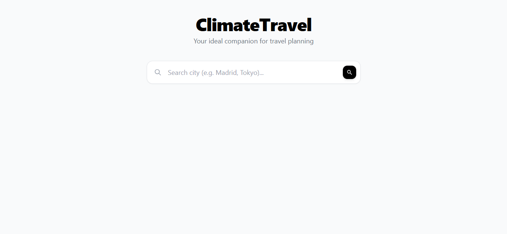
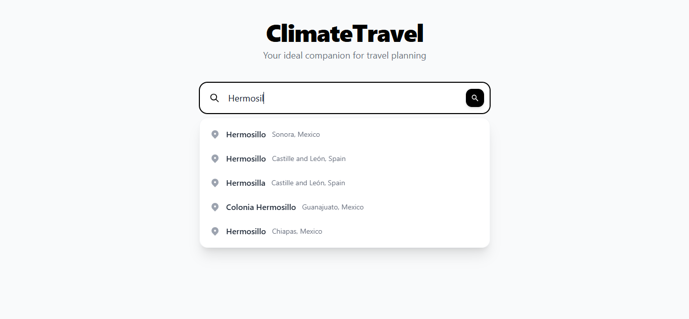
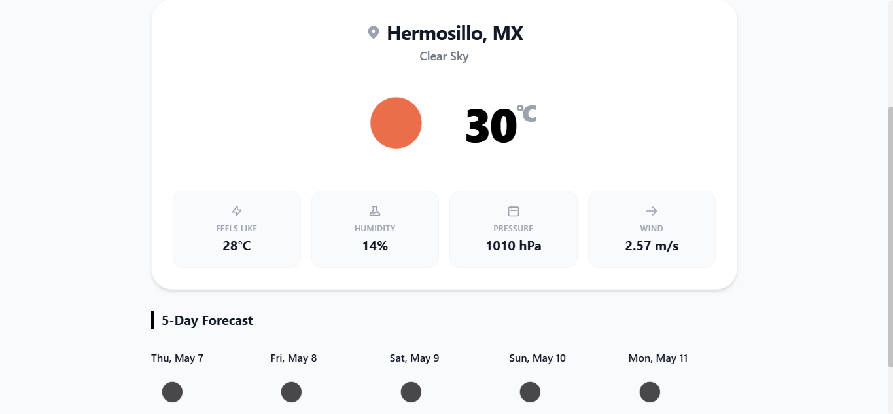
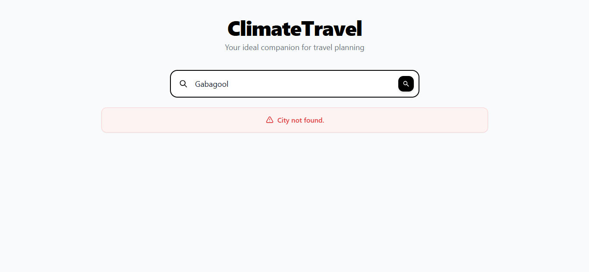

# ClimateTravel Weather Widget


A modern, responsive, and robust weather application built with Angular 17 and Tailwind CSS. The app provides real-time weather conditions and a 5-day forecast for any city in the world, with a sleek, minimalist light-themed UI.

## 📸 Previews

Here are some screenshots of the application in action:

### 1. Clean Search Interface


### 2. Fast Autocompletion


### 3. Detailed Weather & 5-Day Forecast


### 4. Robust Error Handling


## 🌟 Features

- **Real-Time Data**: Consumes the OpenWeatherMap API for accurate current weather and 5-day forecasts.
- **Fast Autocomplete**: Uses the Open-Meteo Geocoding API for instant, keyless, and accurate city suggestions.
- **Modern UI**: Designed with Tailwind CSS featuring a clean "white on grey" aesthetic, smooth animations, and responsive grid layouts.
- **Local Caching**: Remembers your last 5 searches using `localStorage` for a better user experience.
- **Error Handling**: Comprehensive error catching (404s, invalid keys, network offline) with user-friendly alerts.

## 🚀 Getting Started

### Prerequisites
- Node.js installed
- Angular CLI (`npm install -g @angular/cli`)

### Installation
1. Clone the repository:
   ```bash
   git clone https://github.com/SeaBassy4/AngularClimateTravel.git
   ```
2. Navigate to the project directory:
   ```bash
   cd proyecto-final
   ```
3. Install dependencies:
   ```bash
   npm install
   ```

### Configuration
In `src/environments/environment.ts` and `src/environments/environment.development.ts`, ensure your API keys are set:
```typescript
export const environment = {
  production: false,
  openWeatherKey: 'YOUR_API_KEY_HERE', // Add your OpenWeatherMap API Key here
  openWeatherApiUrl: 'https://api.openweathermap.org/data/2.5',
  openWeatherGeoUrl: 'https://api.openweathermap.org/geo/1.0',
  openMeteoGeoUrl: 'https://geocoding-api.open-meteo.com/v1'
};
```

### Development server
Run `npm run start` or `ng serve` for a dev server. Navigate to `http://localhost:4200/`. The application will automatically reload if you change any of the source files.
